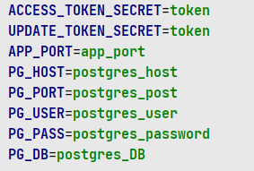

    <h1 class="h1">Hello, I'm Front-end developer Lavrentij</h1>
    <h2 class="h2" style="max-width: 400px; text-align: center; margin-top: 15px;">This is my pet project witch idea based on commercial order.</h2>
    
App concept:  
    We have accounts that authentication occurs using <a href="https://jwt.io/" class="link">JWT tokens</a>, that stored in Cookies. 
    Account have fields:
      - id (unique id),
      - email (unique email, used for operation with an account and registration),
      - name (name chosen during registration),
      - password (password chosen during registration, stored in DB encrypted),
      - money (amount of fictional money),
      - wheels (tries for spin <b><i>Magic wheel</i></b>),
      - role (USER or ADMIN, only admin have access to an admin panel),
      - lists and meditations (some kind of prize, it can be an audio file, but it doesn't exist).
     In original App <i>lists</i>, <i>meditations</i> and <i>money</i> could be received by writing to the administration (by built-in feedback sender).
     Users won prizes by using Promocodes and spinning <b><i>Magic wheel</i></b>.
     Tries for spins and promocodes were purchased from the administration.

    
Navigation:

    <ul class="ul">
        <li>
            <a href="#frontend" class="li1">Front-end (will be added soon)</a>
        </li>
        <li>
            <a href="#backend" class="li1">Back-end</a>
            <ul>
                <li><a href="#backend_why" class="li2">Why PostgresQL + NestJS</a></li>
                <li>
                    <a href="#backend_setup" class="li2">Setup for running</a>
                    <ul>
                        <li><a href="#backend_db" class="li3">Database</a></li>
                        <li><a href="#backend_env" class="li3">Environment</a></li>
                    </ul>
                </li>
                <li>
                    <a href="#backend_inside_code" class="li2">Inside code</a>
                    <ul>
                        <li><a href="#backend_connect_db" class="li3">Connect database</a></li>
                        <li><a href="#backend_controllers" class="li3">Controllers</a></li>
                        <li><a href="#backend_services" class="li3">Services</a></li>
                        <li><a href="#backend_middle" class="li3">Middleware</a></li>
                        <li><a href="#backend_config" class="li3">Configuration</a></li>
                        <li><a href="#backend_test" class="li3">Testing</a></li>
                        <li><a href="#backend_swagger" class="li3">Swagger</a></li>
                    </ul>
                </li>
                <li><a href="#backend_scripts" class="li2">NPM scripts</a></li>
            </ul>
        </li>
        <li>
            <a href="#contacts" class="li1">Contacts</a>
        </li>
    </ul>
    <section id="backend">
        <h2 class="h2 border">Back-end</h2>
        

            <h3 id="backend_why" class="h3">Why <a class="link" href="https://www.postgresql.org/">PostgresQL</a> + <a class="link" href="https://nestjs.com/">NestJS</a></h3>
            

                
This is back-end of <b><i>Magic wheel</i></b>. Its technology stack: a database is <a class="link" href="https://www.postgresql.org/">PostgresQL</a>, as a back-end I choose <a class="link" href="https://nestjs.com/">NestJS</a> (framework for NodeJS) + <a class="link" href="https://expressjs.com/">Express</a>.

                

                    <a class="link" href="https://www.postgresql.org/">PostgresQL</a> in case that:
                      - It has flexible access to data, its organization and storage.
                      - Supports a lot of data types and data formats (XML, JSON, run as NoSQL, etc.)
                      - Support V8 JS engine, correspond <a href="https://en.wikipedia.org/wiki/ACID" class="link">ACID</a>
                      - Good npm packages: <a href="https://www.npmjs.com/package/pg" class="link">pg</a>, <a href="https://www.npmjs.com/package/pg-hstore" class="link">pg-hstore</a>
                      - Functional UI <a class="link" href="https://www.pgadmin.org/">PgAdmin</a>
                      - <a href="https://git.postgresql.org/gitweb/?p=postgresql.git;a=summary" class="link">OpenSource</a> and cross-platform
                

                
<a class="link" href="https://nestjs.com/">NestJS</a> is my chose for Javascript (Typescript) back-end, due to the following advantages:
                      - Required Typescript
                      - Built-in <a class="link" href="https://expressjs.com/">Express</a> integration
                      - Powerful <a href="https://docs.nestjs.com/cli/overview" class="link">CLI</a> 
                      - Can be used for both Monoliths and Microservices
                      - well-organized structure (controllers, services, guards and repositories in specific locations and in a specific manner)
                      - Syntax's 'sugar' like decorators
                      - OpenSource
                

            

        
 
        

            <h3 id="backend_setup" class="h3">Setup for running</h3>
            

                
It is assumed that the necessary software is already installed on your computer (NodeJS, NPM, <a class="link" href="https://www.postgresql.org/">PostgresQL</a>) and dependencies from <a href="backend/package.json" class="link"><b><i>backend/package.json</i></b></a> installed.

                <h4 class="h4" id="backend_db">Database</h4>
                
You can find file <a href="backend/src/database/db.sql" class="link"><i><b>backend/src/database/db.sql</b></i></a>  with SQL queries for a database. Firstly we need to create DB:

<code>CREATE DATABASE DB_NAME;</code>
                
Then define extension for generate IDs

<code>CREATE EXTENSION IF NOT EXISTS "uuid-ossp";</code>
                
When DB is ready for creating Tables, copy commands from <a href="backend/src/database/db.sql" class="link"><i><b>db.sql</b></i></a>, eventually we have four tables: (<i>Users</i>, <i>Promocodes</i>, <i>Products</i>, <i>Feedback</i>).

                <h4 class="h4" id="backend_env">Environment</h4>
                
You need to create <b><i>.env</i></b> file in directory <a href="backend" class="link"><b><i>backend/</i></b></a>. Then put here <i>environment variables</i> if format:

<code>VAR_NAME=VAR_VALUE</code>
                
Each new variable is written on a new line, without special characters between them. In our App we need these variables: token's secrets used to verify <a href="https://jwt.io/" class="link">JWT tokens</a>, APP_PORT on which our application runs, other variables need to connect DB (name, user, password...).

                
            

        

        

            <h3 id="backend_inside_code" class="h3">Inside code</h3>
            

                <h4 class="h4" id="backend_connect_db">Connect database</h4>
                

                    
We can connect DB in two ways, by separate parameters in config:

<pre>
let localPoolConfig: db_config = {
    password: process.env.PG_PASS,
    user: process.env.PG_USER,
    host: process.env.PG_HOST,
    port: process.env.PG_PORT,
    database: process.env.PG_DB,
};
</pre>
                    
Or use <code>DB_CONNECTION_STRING</code> that usually uses on servers. I use both, if <code>DB_CONNECTION_STRING</code> doesnt exist use <code>localPoolConfig</code>

<pre>
const poolConfig: object = process.env.DB_CONNECTION_STRING
	? {
			connectionString: process.env.DB_CONNECTION_STRING,
			ssl: { rejectUnauthorized: false },
	  }
	: localPoolConfig;
</pre>
                

                <h4 class="h4" id="backend_controllers">Controllers</h4>
                

                    

                

                <h4 class="h4" id="backend_services">Services</h4>
                

                    

                
                
                <h4 class="h4" id="backend_middle">Middleware</h4>
                

                    

                
                
                <h4 class="h4" id="backend_config">Configuration</h4>
                

                    

                
                
                <h4 class="h4" id="backend_test">Testing</h4>
                

                    

                

                <h4 class="h4" id="backend_swagger">Swagger</h4>
                

                    

                
            
            

        

        

            <h3 id="backend_scripts" class="h3">NPM scripts</h3>
            

                
<code>npm run start</code> Start app in development mode, if files changed reloads.

                
<code>npm run build</code> Build app for production usage.

                
<code>npm run test</code> Run all <a href="https://mochajs.org/" class="link">Mocha</a> tests in tests dir.

                
<code>npm run format</code> Format all files with <a href="https://prettier.io/" class="link">prettier</a>.

                
<code>npm run lint-fix</code> Fix all code-style problems.

            

        

    </section>
    <section>
        <h2 class="h2 border" id="contacts">Contacts</h2>
        
Thanks for reading, you can link me by the contacts below:
         <a href="https://t.me/Blatisgense" class="link" style="padding-left: 15px;">Telegram</a> - @Blatisgense (best way)
         <a href="https://discordapp.com/users/559703556295360512/" class="link" style="padding-left: 15px;">Discord</a> - blatisgense
         <a href="https://join.skype.com/invite/qPov3jKdAoRs" class="link" style="padding-left: 15px;">Skype</a> - blatisgense
         <a href="mailto: lavr.marudenko@gmail.com" class="link" style="padding-left: 15px;">Email</a> - lavr.marudenko@gmail.com
        

    </section>

